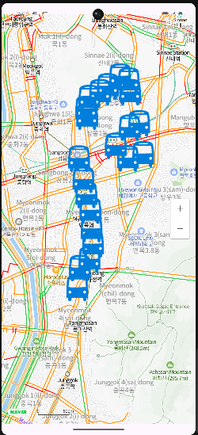
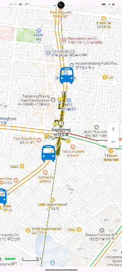
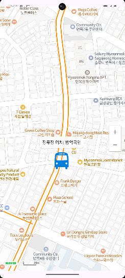

# Map

**네이버 지도 API를 활용하여 안드로이드 지도앱 만들기**

네이버에서 제공하는 **지도 API**를 활용하여 **정류장의 위치**를 표시하는 간단한 프로젝트를 만들어 보았습니다.

### 사용 언어
- **Java**

### 사용 API
- **네이버 지도 API**

### 사용 IDE
- **안드로이드 스튜디오**

#### 1. **처음 시작 화면**
앱 실행 시 **처음 지도에 표시될 곳의 좌표**를 지정하여 초기 화면을 설정했습니다.

#### 2. **교통 흐름도 및 마커 추가**
오른쪽 **+ 버튼**을 클릭하여 지도를 확대하면, 네이버 지도에서 제공하는 기능중에 교통흐름도의 표시를 하도록 구현하였습니다. 또한, **공공데이터포털**에서 제공하는 **버스 정류장들의 좌표**를 몇 개 가져와서 **마커**를 찍어서 구현했습니다. 마커 이미지는 **구글에서 무료 이미지를 찾아** 사용하여 꾸며주었습니다.

#### 3. **마커 클릭 시 정류장 정보 표시**
마커 클릭 시마다 **정류장이 무엇인지를 표시하는 텍스트**를 추가하였습니다.

